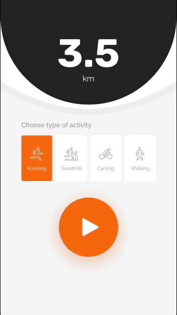

<br><br>
# MiFit


MiFit is a Swift component for a fitness app. It allows the user to switch between the map (current activity progress) and current activity settings. 

- [Requirements](#requirements)
- [Installation](#installation)
- [License](#license)

Here is an example of the animation for a MiFit-like app:



During the exercise, the user can check the distance, speed, time, etc., then return to the route and continue the movement. 

## Requirements

- iOS 11.0+
- Xcode 11.0+
- Swift 5.0+

## Installation

### CocoaPods

To integrate MiFit into your Xcode project with CocoaPods, specify it in your `Podfile`:

```ruby
pod 'MiFit', :git => 'https://github.com/shakurocom/MiFitDemo.git', :commit => 29c0f8f09e90f85f0ecee2e4d5963b0bfe069682
```

Then, run the following command:

```bash
$ pod install
```

### Manually

If you prefer not to use CocoaPods, you can integrate Shakuro.MiFit simply by copying it to your project.

## License

Shakuro.MiFit is released under the MIT license. [See LICENSE](https://github.com/shakurocom/ScrollableTabs/blob/master/LICENSE.md) for details.

## Give it a try and reach us

Star this tool if you like it, it will help us grow and add new useful things. 
Feel free to reach out and hire our team to develop a mobile or web project for you.


